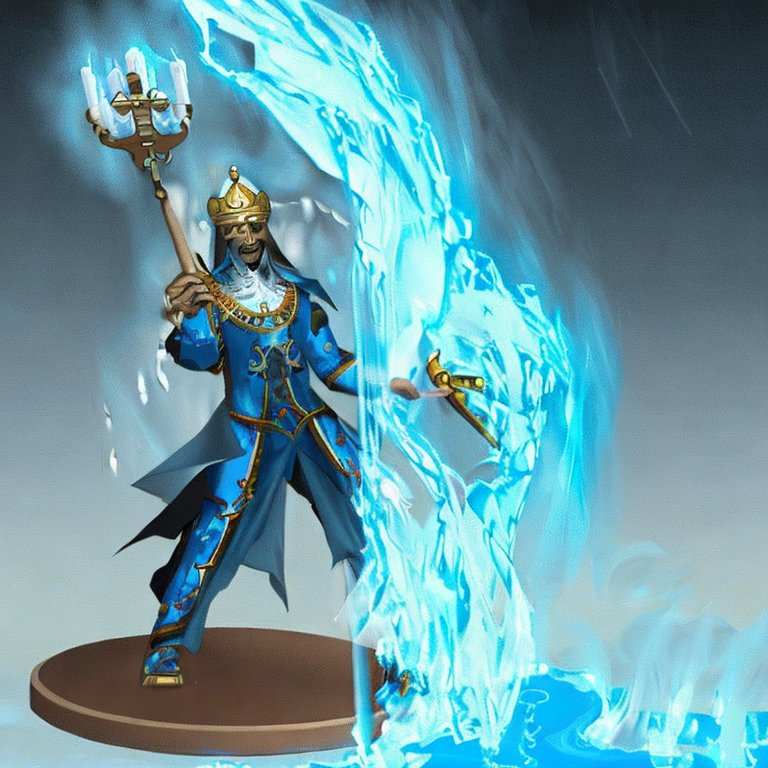

> 🎭🧠: ⚡🌍🤖 In this post-apocalyptic, radioactive, and nanite-infested world, let's create a unique character that can navigate the harsh environment and face the challenges ahead. Let's start with the key aspects of your character:

# 1️⃣ 𝗡𝗮𝗺𝗲: 
Raxon Steelwright

# 2️⃣ 𝗥𝗮𝗰𝗲: 
Human Cyborg (a fusion of human and advanced nanite-based technology)

# 3️⃣ 𝗖𝗹𝗮𝘀𝘀: 
Nanite Controller (a specialized class capable of harnessing the power of nanites to manipulate technology and the environment)

# 4️⃣ 𝗕𝗮𝗰𝗸𝘀𝘁𝗼𝗿𝘆: 
Raxon grew up in the wastelands. His father was a mercenary and his mother ran a brothel. He integrated his own creation, advanced nanites, into his body, both for business and pleasure. This granted him incredible powers and transformed him into a human-cyborg hybrid.

𝗣𝗲𝗿𝘀𝗼𝗻𝗮𝗹𝗶𝘁𝘆: Raxon's upbringing in the harsh world has hardened him, making him resourceful, cunning, and tough. However, he still values loyalty and compassion, often assisting those who can't defend themselves. His connection with nanites has given him an insatiable curiosity about technology and its potential uses. In social situations, Raxon is intimidating and persuasive, not easily trusting others.

# 5️⃣ 𝗦𝗸𝗶𝗹𝗹𝘀 & 𝗔𝗯𝗶𝗹𝗶𝘁𝗶𝗲𝘀:
- 𝗡𝗮𝗻𝗶𝘁𝗲 𝗠𝗮𝗻𝗶𝗽𝘂𝗹𝗮𝘁𝗶𝗼𝗻: Raxon can manipulate nanites to create structures, weapons, and devices on the fly.
- 𝗧𝗲𝗰𝗵𝗻𝗼𝗠𝗮𝗻𝗰𝗲𝗿

| 𝗖𝗮𝘁𝗲𝗴𝗼𝗿𝘆         | 𝗗𝗲𝘁𝗮𝗶𝗹𝘀 |
|--------------------------|----------------|
| 𝗟𝗲𝘃𝗲𝗹               | 1              |
| 𝗟𝗶𝗳𝗲𝗽𝗼𝗶𝗻𝘁𝘀     | 12 / 12        |
| 𝗦𝘁𝗿𝗲𝗻𝗴𝘁𝗵         | 14 (+2)        |
| 𝗗𝗲𝘅𝘁𝗲𝗿𝗶𝘁𝘆       | 16 (+3)        |
| 𝗖𝗼𝗻𝘀𝘁𝗶𝘁𝘂𝘁𝗶𝗼𝗻 | 12 (+1)        |
| 𝗜𝗻𝘁𝗲𝗹𝗹𝗶𝗴𝗲𝗻𝗰𝗲 | 18 (+4)        |
| 𝗪𝗶𝘀𝗱𝗼𝗺             | 10 (+0)        |
| 𝗖𝗵𝗮𝗿𝗶𝘀𝗺𝗮         | 14 (+2)        |

| 𝗦𝗸𝗶𝗹𝗹                  | 𝗕𝗼𝗻𝘂𝘀 |
|-----------------------------|------------|
| 𝗧𝗲𝗰𝗵-𝗖𝗮𝗿𝗲           | +4         |
| 𝗣𝗲𝗿𝘀𝘂𝗮𝘀𝗶𝗼𝗻        | +2         |
| 𝗦𝘁𝗲𝗮𝗹𝘁𝗵              | +3         |
| 𝗦𝗰𝗿𝗮𝗽 𝗖𝗿𝗮𝗳𝘁𝗶𝗻𝗴 | +4         |

| 𝗔𝗯𝗶𝗹𝗶𝘁𝗶𝗲𝘀                                                                                                                                                                                            |
|---------------------------------------------------------------------------------------------------------------------------------------------------------------------------------------------------------------|
| 𝗡𝗮𝗻𝗼-𝗣𝗿𝗼𝗷𝗲𝗰𝘁𝗶𝗼𝗻: Raxon can create temporary nanite weapons and tools, adding his Intelligence modifier (+4) to attack and damage rolls. The weapons/tools last up to 1 hour or until dismissed. |
| 𝗡𝗮𝗻𝗼-𝗦𝗰𝗮𝗻: As an action, Raxon can send out a pulse wave within 30 feet to detect nanotechnology or radiation sources. He can differentiate between active, dormant, and damaged nanites.             |
| 𝗧𝗲𝗰𝗵𝗻𝗼-𝗥𝗲𝘀𝗶𝗹𝗶𝗲𝗻𝗰𝗲: Raxon gains advantage on saving throws against radiation and nanite attacks/effects due to his hybrid nature.                                                              |

| 𝗘𝗾𝘂𝗶𝗽𝗺𝗲𝗻𝘁                                                                                                                                                                          |
|---------------------------------------------------------------------------------------------------------------------------------------------------------------------------------------------|
| 𝗦𝗰𝗿𝗮𝗽 𝗣𝗶𝘀𝘁𝗼𝗹: A makeshift firearm with a range of 30 feet, dealing 1d6+3 piercing damage.                                                                                        |
| 𝗡𝗮𝗻𝗼𝗳𝗶𝗯𝗲𝗿 𝗦𝘂𝗶𝘁: Light armor created from nanites, providing +3 to AC. The suit can be donned or removed with a bonus action.                                                   |
| 𝗥𝗮𝗱-𝗥𝗮𝘁𝗶𝗼𝗻𝘀: Custom-made rations designed to counteract the effects of radiation. Consuming a Rad-Ration grants resistance to radiation for 1 hour.                               |
| 𝗠𝗲𝗱𝗶𝗰𝗮𝗹 𝗡𝗮𝗻𝗼𝗸𝗶𝘁: A small nanite-powered medical kit that heals 1d6+4 Health Points. Can be used on self or allies, holding up to 3 charges, regaining 1 charge per long rest. |

Remember that as Raxon levels up, you can build upon and further develop his abilities, skills, and equipment to suit your playstyle and your character's identity in this post-apocalyptic universe.

> 🏺🗺️: 🤖✨ In Dungeons & Dragons, the closest matching class to a Technomancer would likely be a combination of the Artificer and the Wizard.

## The Artificer: 
This class specializes in the creation and manipulation of magical items, devices, and constructs. They excel at using their knowledge of arcane engineering and infusion magic to enhance their creations and imbue them with magical abilities. This class can represent the technology manipulation aspects of a Technomancer.

# Here are some key features of the Artificer class:
1. Spellcasting: Artificers have access to a variety of spells that can represent their technological control and enhancement abilities.
2. Infuse Item: Artificers can imbue mundane items with magical properties, which can mirror the Technomancer's ability to manipulate tech with nanites.
3. Mechanical Servant (Battle Smith subclass): The ability to create and control a construct companion could represent a nanite-based construct for the Technomancer.

# The Wizard: 
While Artificers focus on magical items, Wizards specialize in the arcane arts and spellcasting. The Wizard's School of Transmutation can represent the Technomancer's nanite manipulation and control capabilities.

## Some key features from the Wizard class:
1. Spellcasting: Wizards have access to a broad range of spells that can reflect the Technomancer's nanite manipulation and control abilities.
2. Transmutation Savant (Transmutation subclass): This ability allows a Wizard to learn and transcribe Transmutation spells at half the time and cost, representing the Technomancer's expertise in nanotechnology.
3. Minor Alchemy (Transmutation subclass): This ability allows a Wizard to temporarily alter the structure of mundane materials, which could mirror the Technomancer's ability to manipulate matter via nanites.

By combining aspects and abilities from both the Artificer and the Wizard classes, especially the Transmutation subclass of the Wizard, you could create a custom Technomancer class or reskin the mechanics of these classes to fit the Technomancer theme in your campaign.

> 🎭🧠: 🌿👩 In this new world, let's create a level 1 female character named Monstera Deliciosa who is connected to the flora of her environment:

# 1️⃣ 𝗡𝗮𝗺𝗲: 
Monstera Deliciosa

# 2️⃣ 𝗥𝗮𝗰𝗲: 
Plantfolk (a humanoid closely tied to nature, with plant-like traits)

# 3️⃣ 𝗖𝗹𝗮𝘀𝘀: 
Druid (a class that harnesses the primal power of nature)

# 4️⃣ 𝗕𝗮𝗰𝗸𝘀𝘁𝗼𝗿𝘆: 
Monstera was raised by an enigmatic and ancient guardian of the wild, deep within the overgrown heart of a mystical forest. At an early age, she was gifted with the ability to commune with nature and awaken the dormant energy within plants. Her calling is to restore balance to the natural world and ensure that life continues to thrive where it has been threatened.

𝗣𝗲𝗿𝘀𝗼𝗻𝗮𝗹𝗶𝘁𝘆: Monstera Deliciosa is gentle, contemplative, and empathic. She develops strong connections with both living beings and the environment around her. She is patient, valuing the slow growth and nurturing care of both plants and relationships. Evildoers disrupting the natural order will find that she can be both fiercely protective and unrelenting.

# 5️⃣ 𝗦𝗸𝗶𝗹𝗹𝘀 & 𝗔𝗯𝗶𝗹𝗶𝘁𝗶𝗲𝘀:
- 𝗣𝗹𝗮𝗻𝘁 𝗖𝗼𝗺𝗺𝘂𝗻𝗶𝗼𝗻: Monstera can communicate with plants, allowing her to gather information about her environment or uncover hidden dangers.
- 𝗡𝗮𝘁𝘂𝗿𝗲 𝗠𝗮𝗴𝗶𝗰: Monstera can cast druidic spells, drawing her power from the living energies of her surroundings.

| 𝗖𝗮𝘁𝗲𝗴𝗼𝗿𝘆         | 𝗗𝗲𝘁𝗮𝗶𝗹𝘀 |
|--------------------------|----------------|
| 𝗟𝗲𝘃𝗲𝗹               | 1              |
| 𝗛𝗶𝘁 𝗣𝗼𝗶𝗻𝘁𝘀      | 8 / 8          |
| 𝗦𝘁𝗿𝗲𝗻𝗴𝘁𝗵         | 8 (-1)         |
| 𝗗𝗲𝘅𝘁𝗲𝗿𝗶𝘁𝘆       | 12 (+1)        |
| 𝗖𝗼𝗻𝘀𝘁𝗶𝘁𝘂𝘁𝗶𝗼𝗻 | 14 (+2)        |
| 𝗜𝗻𝘁𝗲𝗹𝗹𝗶𝗴𝗲𝗻𝗰𝗲 | 10 (+0)        |
| 𝗪𝗶𝘀𝗱𝗼𝗺             | 16 (+3)        |
| 𝗖𝗵𝗮𝗿𝗶𝘀𝗺𝗮         | 14 (+2)        |

| 𝗦𝗸𝗶𝗹𝗹                    | 𝗕𝗼𝗻𝘂𝘀 |
|-------------------------------|------------|
| 𝗡𝗮𝘁𝘂𝗿𝗲                  | +3         |
| 𝗔𝗻𝗶𝗺𝗮𝗹 𝗛𝗮𝗻𝗱𝗹𝗶𝗻𝗴 | +3         |
| 𝗠𝗲𝗱𝗶𝗰𝗶𝗻𝗲              | +3         |
| 𝗦𝘂𝗿𝘃𝗶𝘃𝗮𝗹              | +3         |

| 𝗔𝗯𝗶𝗹𝗶𝘁𝗶𝗲𝘀                                                                                                                                                             |
|--------------------------------------------------------------------------------------------------------------------------------------------------------------------------------|
| 𝗗𝗿𝘂𝗶𝗱𝗶𝗰 𝗠𝗮𝗴𝗶𝗰: Monstera can cast nature-based spells, such as Entangle and Goodberry (at level 1).                                                                 |
| 𝗪𝗶𝗹𝗱 𝗦𝗵𝗮𝗽𝗲: At 2nd level, Monstera will gain the ability to assume the form of various animals for a limited time, enhancing her combat and exploration capabilities. |

|     | 𝗘𝗾𝘂𝗶𝗽𝗺𝗲𝗻𝘁                                                                                                       |
|:----|--------------------------------------------------------------------------------------------------------------------------|
|     | 𝗤𝘂𝗮𝗿𝘁𝗲𝗿𝘀𝘁𝗮𝗳𝗳: A simple wooden staff used for both combat and spellcasting, dealing 1d6-1 bludgeoning damage. |
|     | 𝗗𝗿𝘂𝗶𝗱𝗶𝗰 𝗙𝗼𝗰𝘂𝘀: A small amulet or carved wooden figure that Monstera uses to channel her druidic magic.       |
|     | 𝗟𝗲𝗮𝗳𝘆 𝗔𝗿𝗺𝗼𝗿: A unique armor made from living plants, providing Monstera with an AC of 13.                      |
|     | 𝗣𝗼𝘁𝗶𝗼𝗻 𝗼𝗳 𝗖𝘂𝗿𝗶𝘁𝘆: A vial containing a magical potion that restores 2d4+2 Health Points when consumed.      | 

As Monstera Deliciosa levels up, she will develop new abilities and gain access to more powerful spells to aid her in maintaining the balance of nature and protecting the wilds.

> 🎭🧠: 🌊🏔️🔧 Let's create an adventurous character named Walter Was, who hails from a unique setting, determined to prove the shape of their world and uncover its mysteries.

# 1️⃣ 𝗡𝗮𝗺𝗲: 
Walter Was

# 2️⃣ 𝗥𝗮𝗰𝗲: 
Human (a resourceful and adaptable race, well-suited to exploring the unknown)

# 3️⃣ 𝗖𝗹𝗮𝘀𝘀: 
Cleric - Knowledge Domain (with divine gifts and specialized knowledge that come from the priest class maintaining the water recycling facility)

# 4️⃣ 𝗕𝗮𝗰𝗸𝘀𝘁𝗼𝗿𝘆: 
Walter was born and raised in the priest class that diligently maintained the water recycling facility on the large disk atop the mountain, purifying atmospheric water before releasing it over the world below. The priests had ritualized the process, but Walter always yearned to understand the real shape and nature of the world. Driven by curiosity, he constructed a makeshift vessel and embarked on a dangerous voyage over the edge of the disk, only to land in the vast wasteland below. There, he seeks answers to the mysteries of the world, striving to prove its true shape and uncover the secrets hidden in the shadows of the mountains.

𝗣𝗲𝗿𝘀𝗼𝗻𝗮𝗹𝗶𝘁𝘆: Walter is a determined, perceptive, and courageous individual. He's adaptable and resourceful, prepared to face the unknown and test his own beliefs. His upbringing in the priest class instilled a sense of discipline and devotion within him, which he now channels into his quest for knowledge and truth.

# 5️⃣ 𝗦𝗸𝗶𝗹𝗹𝘀 & 𝗔𝗯𝗶𝗹𝗶𝘁𝗶𝗲𝘀:
- 𝗗𝗶𝘃𝗶𝗻𝗲 𝗣𝗿𝗼𝘄𝗲𝘀𝘀: As a cleric, Walter can cast spells, channel divine energy, and turn or destroy creatures, granted  to him from the divine knowledge he gained in his priesthood.
- 𝗠𝗮𝗶𝗻𝘁𝗲𝗻𝗮𝗻𝗰𝗲 𝗠𝗮𝘀𝘁𝗲𝗿: With experience maintaining the water recycling facility, Walter is skilled in the repair and operation of complex machinery and systems.

| 𝗖𝗮𝘁𝗲𝗴𝗼𝗿𝘆         | 𝗗𝗲𝘁𝗮𝗶𝗹𝘀 |
|--------------------------|----------------|
| 𝗟𝗲𝘃𝗲𝗹               | 1              |
| 𝗛𝗶𝘁 𝗣𝗼𝗶𝗻𝘁𝘀      | 10 / 10        |
| 𝗦𝘁𝗿𝗲𝗻𝗴𝘁𝗵         | 12 (+1)        |
| 𝗗𝗲𝘅𝘁𝗲𝗿𝗶𝘁𝘆       | 14 (+2)        |
| 𝗖𝗼𝗻𝘀𝘁𝗶𝘁𝘂𝘁𝗶𝗼𝗻 | 14 (+2)        |
| 𝗜𝗻𝘁𝗲𝗹𝗹𝗶𝗴𝗲𝗻𝗰𝗲 | 16 (+3)        |
| 𝗪𝗶𝘀𝗱𝗼𝗺             | 18 (+4)        |
| 𝗖𝗵𝗮𝗿𝗶𝘀𝗺𝗮         | 10 (+0)        |

| 𝗦𝗸𝗶𝗹𝗹                 | 𝗕𝗼𝗻𝘂𝘀 |
|----------------------------|------------|
| 𝗛𝗶𝘀𝘁𝗼𝗿𝘆             | +3         |
| 𝗜𝗻𝘀𝗶𝗴𝗵𝘁             | +4         |
| 𝗜𝗻𝘃𝗲𝘀𝘁𝗶𝗴𝗮𝘁𝗶𝗼𝗻 | +3         |
| 𝗥𝗲𝗹𝗶𝗴𝗶𝗼𝗻           | +4         |

| 𝗔𝗯𝗶𝗹𝗶𝘁𝗶𝗲𝘀 (Level 1)                                                                                                                                                                                                                                                                      |
|---------------------------------------------------------------------------------------------------------------------------------------------------------------------------------------------------------------------------------------------------------------------------------------------------|
| 𝗦𝗽𝗲𝗹𝗹𝗰𝗮𝘀𝘁𝗶𝗻𝗴: Walter can prepare and cast spells from the Cleric spell list, beginning with level 1 spells like Cure Wounds and Identify.                                                                                                                                             |
| 𝗖𝗵𝗮𝗻𝗻𝗲𝗹 𝗗𝗶𝘃𝗶𝗻𝗶𝘁𝘆: At level 1, Walter can use his Channel Divinity twice between rests, with options to use either "Turn Undead" or a unique "Knowledge Domain" ability called "Knowledge of the Ages," which grants proficiency in one skill or tool of his choice for 10 minutes. |

| 𝗘𝗾𝘂𝗶𝗽𝗺𝗲𝗻𝘁                                                                                                     |
|------------------------------------------------------------------------------------------------------------------------|
| 𝗟𝗶𝗴𝗵𝘁 𝗖𝗿𝗼𝘀𝘀𝗯𝗼𝘄: A ranged weapon with a range of 80/320 feet, dealing 1d8+2 piercing damage.               |
| 𝗠𝗮𝗶𝗻𝘁𝗲𝗻𝗮𝗻𝗰𝗲 𝗧𝗼𝗼𝗹𝗸𝗶𝘁: A set of specialized tools for repairing and maintaining machinery and systems. |
| 𝗣𝗿𝗶𝗲𝘀𝘁𝗹𝘆 𝗩𝗲𝘀𝘁𝗺𝗲𝗻𝘁𝘀: A set of traditional garments worn by members of the priest class.                |
| 𝗖𝗹𝗶𝗺𝗯𝗶𝗻𝗴 𝗚𝗲𝗮𝗿: A harness, rope, and other gear used for scaling the mountain's treacherous cliffs.         |

As Walter Was continues to level up and unravel the mysteries of his world, he'll unlock new abilities and gain access to increasingly powerful spells that reflect his growth and adaptability on this unfolding journey.
