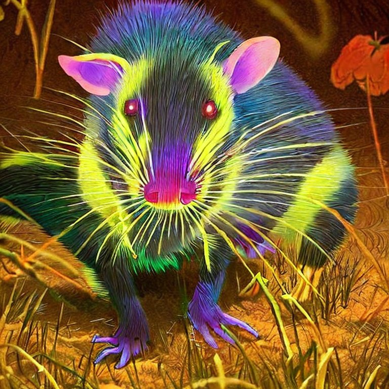
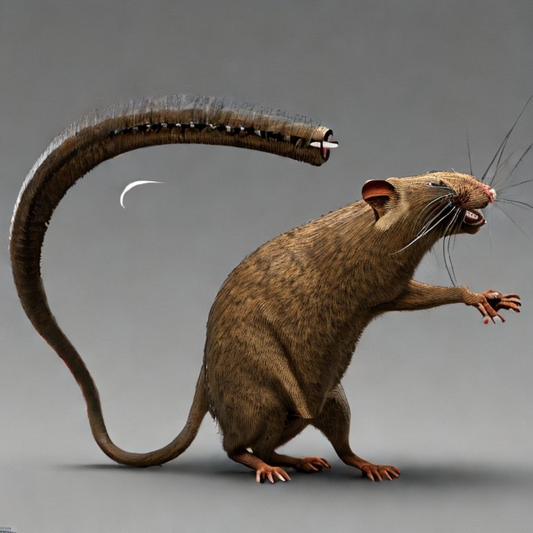
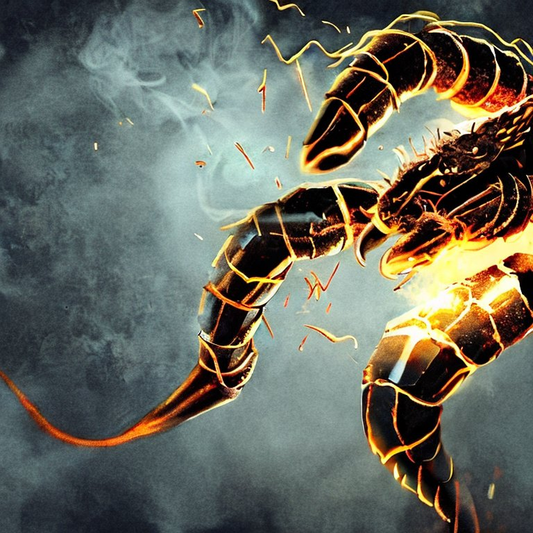
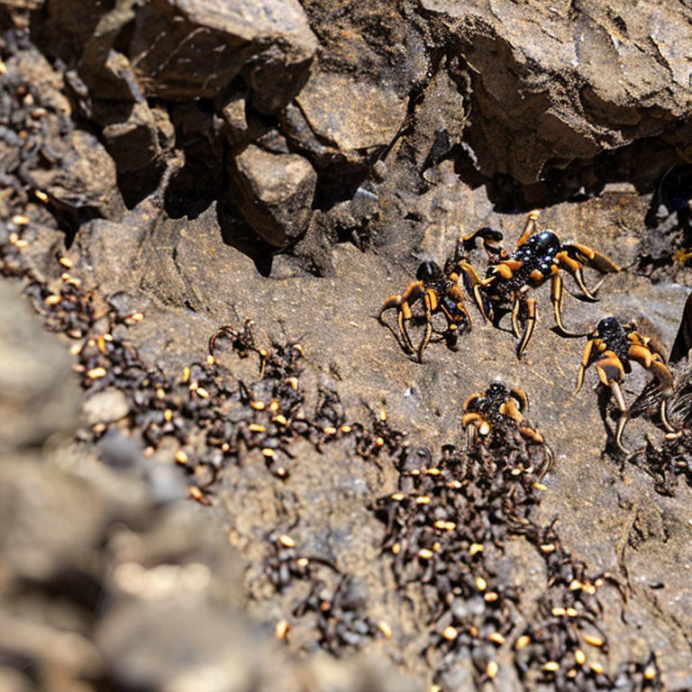
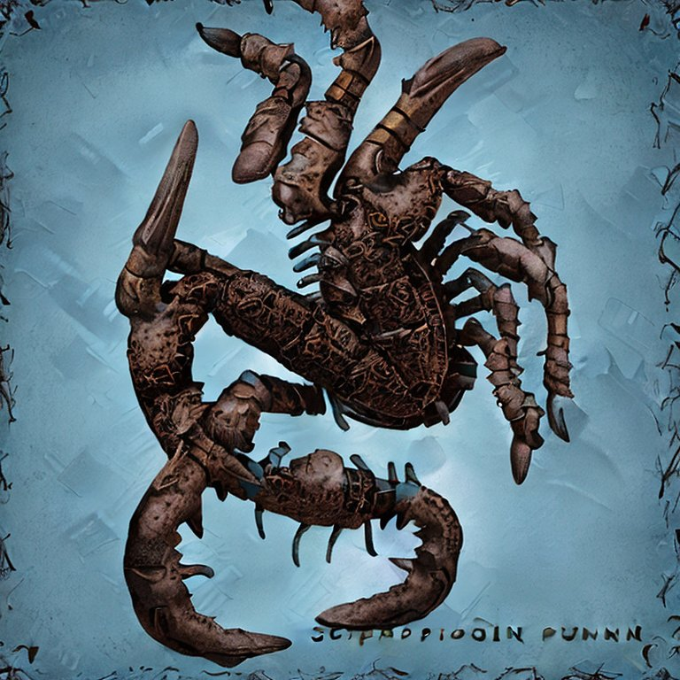
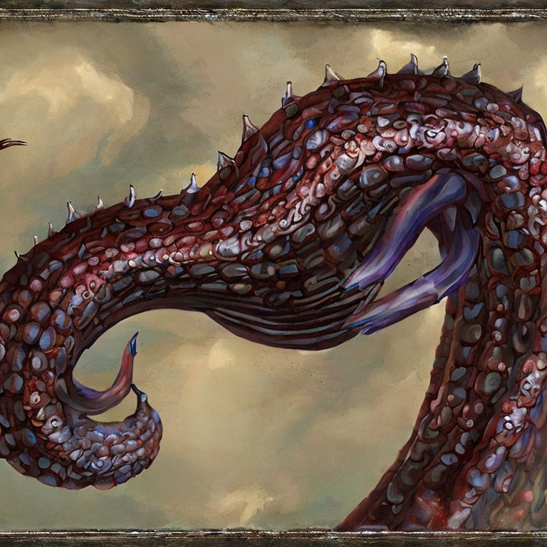

# 🏺🗺️: 🌋🌠 Encounter Scenario:

## Summary
As the party of **_three level 1 characters_** enters the **_ancient science facility_** hidden within the mountain, they traverse a long corridor leading to a metal door they have previously unlocked. As they venture onward, they face an unexplored area ahead.

## First Potential Encounter
In the unexplored area, they may encounter their first challenge: a group of mutated rats and small, scorpion-like creatures known as Scorplings. These creatures have been feasting on the remnants of the once-thriving facility and have developed an aggressive territorial behavior.

## First Combat
The characters must engage in combat with the rats and Scorplings, relying on their teamwork and abilities to survive. Upon defeating these lower-level threats, they will discover a clue (key) in one of the Scorpling carcasses, pointing them toward a bigger danger lurking within the facility.

## The Clue
Following the clue, the party makes their way to the control room and the director's office. Upon activating the lift, they descend into a previously inaccessible area, a large underground chamber housing a massive mutated creature – the Aquatic Wasteland Behemoth.

## Aquatic Wasteland Behemoth
The ancient Aquatic Wasteland Behemoth, once a powerful experiment of the facility, has morphed into a monstrous beast due to the exposure to the mysterious energy source fueling the facility for centuries. It has survived on the Scorplings and mutated rats. In a climactic battle with the Aquatic Wasteland Behemoth, the characters will need to rely on their wits, tactics, and teamwork to survive the monstrous guardian.

## Radiant Resonator
Upon slaying the Aquatic Wasteland Behemoth and further investigating the chamber, the characters discover the artifact they've sought – a rare and ancient-looking device known as the Radiant Resonator. This powerful artifact is encased within the crystallized remains of the energy source that mutated the facility's inhabitants. The Radiant Resonator is capable of emitting a powerful purifying energy, useful for cleansing environments tainted by radiation and other hazardous elements.

## A Successful Mission
As the characters exit the facility, having defeated the mutated creatures, they now possess a valuable tool. The Radiant Resonator will aid them in their quest to navigate and restore life to the treacherous post-apocalyptic world.

## 🤖✨⛰️
Remember to scale the encounters and challenges according to your characters' abilities to ensure a balanced and enjoyable experience for the players. 🤖✨⛰️

## 🏺🗺️: 🌠 Encounter and Stats for Characters

### Segment One (Optional): 
Rats and Scorplings Encounter

## 1. Irradiated Rodents:
- Speed: 20 ft.

### a) Glow Rat
A small mutant rat with a bioluminescent fur that emits dim light.

| HP  | AC  | STR | DEX | CON | INT | WIS | CHA | Attack (Primary)                    | Special Ability                                               |
|-----|-----|-----|-----|-----|-----|-----|-----|-------------------------------------|---------------------------------------------------------------|
| 5   | 11  | 4   | 14  | 11  | 2   | 10  | 4   | Bite: +4 to hit, 1d4 piercing dmg   | Emit dim light (10 ft radius)                                 |

### b) Spike-Tail Rat 
A mutant rat with protruding spikes in its tail that can inflict additional damage during attacks.

| HP  | AC  | STR | DEX | CON | INT | WIS | CHA | Attack (Primary)                    | Special Ability                                               |
|-----|-----|-----|-----|-----|-----|-----|-----|-------------------------------------|---------------------------------------------------------------|
| 7   | 11  | 6   | 14  | 12  | 2   | 10  | 5   | Tail: +4 to hit, 1d4+2 slashing dmg | None                                                          |

### c) Screech Rat 
A mutant rat that emits a high-pitched screech, disrupting focus and concentration of nearby characters.

| HP  | AC  | STR | DEX | CON | INT | WIS | CHA | Attack (Primary)                    | Special Ability                                               |
|-----|-----|-----|-----|-----|-----|-----|-----|-------------------------------------|---------------------------------------------------------------|
| 5   | 11  | 4   | 15  | 11  | 2   | 12  | 3   | Bite: +4 to hit, 1d4 piercing dmg   | Screech: Disrupt concentration (10 ft radius, DC 10 CON save) |

🦠🧬: 🏜️💥🔬 Stats:

## 2. Nanite-Infected Scorplings:
- Speed: 30 ft.

### a) Electric Scorpling 
A tiny scorpion mutated by nanites that delivers mild electric shocks with its stinger.

| HP  | AC  | STR | DEX | CON | INT | WIS | CHA | Attack (Primary)                                       | Special Ability                                           |
|-----|-----|-----|-----|-----|-----|-----|-----|--------------------------------------------------------|-----------------------------------------------------------|
| 5   | 12  | 3   | 15  | 10  | 1   | 8   | 2   | Sting: +4 to hit, 1d4 piercing dmg + 1d4 lightning dmg | None                                                      |

### b) Swarming Scorpling 

A nano-enhanced scorpion capable of releasing a small swarm of tiny, highly poisonous scorplings.

| HP  | AC  | STR | DEX | CON | INT | WIS | CHA | Attack (Primary)                                       | Special Ability                                           |
|-----|-----|-----|-----|-----|-----|-----|-----|--------------------------------------------------------|-----------------------------------------------------------|
| 8   | 12  | 3   | 14  | 12  | 1   | 8   | 2   | Bite: +4 to hit, 1d4 piercing dmg                      | Swarm: Release 3 tiny scorplings (1 HP, +1 to hit, 1 dmg) |

### c) Regenerating Scorpling 
A mutant scorpion that rapidly regenerates itself, requiring precise timing to destroy completely.

| HP  | AC  | STR | DEX | CON | INT | WIS | CHA | Attack (Primary)                                       | Special Ability                                           |
|-----|-----|-----|-----|-----|-----|-----|-----|--------------------------------------------------------|-----------------------------------------------------------|
| 8   | 11  | 5   | 13  | 14  | 1   | 8   | 2   | Bite: +3 to hit, 1d4+1 piercing dmg                    | Regeneration: Heal 2 HP per round                         |

### Segment Two: 

Aquatic Wasteland Behemoth and Scorplings Encounter

#### Aquatic Wasteland Behemoth:
- Speed: 5 ft.
- Tentacle Speed: 40 ft.

| HP  | AC  | STR | DEX | CON | INT | WIS | CHA |
|-----|-----|-----|-----|-----|-----|-----|-----|
| 30  | 14  | 10  | 9   | 14  | 1   | 6   | 2   |

- Attacks:
  * Stinger (+4 to hit, reach 5 ft., 1d6+2 piercing damage, + 1d4 poison dmg)
  * Whiplash (+4 to hit, reach 5 ft., 1d4+2 slashing damage)
- Abilities: 
  1. Empowered Swipe: 
     * Every 1d4 rounds, the Aquatic Wasteland Behemoth can unleash a devastating swipe with one of its arms, targeting all creatures in a 10 ft. cone. 
     * Affected creatures must succeed on a DC 13 Dexterity saving throw or be knocked prone and take 1d6+2 slashing damage.

## 🏺🗺️: 💎🌋 Radiant Resonator

 
Introducing the **Radiant Resonator** artifact, designed to cleanse radiation and neutralize harmful nanite presence:

- **Type**: Wondrous Item (Artifact)
- **Rarity**: Very Rare
- **Attunement**: Requires attunement by a spellcaster
- **Weight**: 3 lbs

### Backstory:

The Radiant Resonator is an enigmatic artifact from the time before the apocalypse, created by the advanced civilization that once thrived across the now-desolate wasteland. 

Designed as a tool for combating the pervasive forces of radiation and insidious nanite infestation.

The artifact was recently discovered by a band of brave explorers in a hidden laboratory, buried deep within the bowels of a mountain. 

Now, the Radiant Resonator might offer new hope to the beleaguered denizens of the post-apocalyptic world.

A prize that might be sought by heroes and villains alike for both its immense power and healing potential.

### Abilities:

1. Purifying Aura: 
   - When activated (as an action), the Radiant Resonator:
     - Emits a purifying energy in a:
       - 10 ft. radius around the wielder
     - The aura lasts for 
       - Up to 10 minutes 
     - Can be deactivated early as a 
       - _Bonus Action_ 
   - While active, the aura has the following effects:
     - It neutralizes radiation in the affected area, making it safe to traverse for the duration.
     - Any harmful nanites within the area are weakened, granting advantage on saves against their effects and resistance to damage caused by them.
     - If any ability, spell or environmental effect would cause diseased or poisoned condition within the area of the artifact, creatures in the area have advantage on saving throws against the condition.

2. Restoration Beam: 
   - As an action, the wielder can channel the artifact's energy into 
     - A **focused beam** with a range of **30 ft**. 
     - The beam can **target** a **single creature**, **structure**, or **object** affected by **radiation** or **harmful nanites** . 
     - Upon a successful ranged spell attack roll by the wielder, the target is cleansed of radiation and the harmful effects of nanites. 
     - This ability can be used once per short or long rest.

3. Scaling Power: 
   - As the characters progress through levels, the power and range of the Radiant Resonator can increase at the GM's discretion. 
   - At higher levels, the artifact could;
     - Gain additional charges
     - New abilities
     - Enhanced effects
   - Such as:
     - Extended aura radius or duration
     - More powerful purification effects, including the removal of curses or magical diseases
     - Increased range, damage, or additional effects for the Restoration Beam, such as healing or removing conditions
     - The ability to control or command weakened nanites within the aura, providing new utility options and creative solutions for the party

4. Sentience (Optional):
   - The Radiant Resonator could also be imbued with sentience, reflecting the advanced nanotechnology within. 
   - This sentience would manifest as an intelligence bound to the artifact, granting;
     - Telepathic communication with the attuned wielder and potentially providing them access to ancient or hidden knowledge from the pre-apocalyptic era.

## Conclusion
As the characters enter the unexplored tunnel where the rats and Scorplings reside, make sure they use their unique abilities to handle the situation effectively. Raxon can use Nanite Manipulation to create makeshift weapons, while Monstera can cast Entangle to control multiple enemies. Walter can utilize his spells like Cure Wounds to support and heal the party.

In the encounter with the Aquatic Wasteland Behemoth, players will face a more significant threat requiring them to use their talents and tactics to the fullest - Raxon using his Nanite abilities defensively and offensively, Monstera controlling the battlefield with her spells, and Walter Was supporting and healing the party while dealing damage with his Light Crossbow.

Make sure you give appropriate opportunities for players to use their skills, abilities, and spells throughout the encounters. It's essential to make each character valuable and vital to the party's success.

Upon defeating the Aquatic Wasteland Behemoth, the characters will discover the Radiant Resonator artifact. When wielded by a character, the Radiant Resonator can emit a purifying energy in a 10 ft. radius, cleansing areas of radiation and harmful nanite presence. The artifact's power level can increase as the characters level up, providing more potent cleansing capabilities at the discretion of the GM.

Tailor these encounters to match the abilities and playstyle of your player characters, ensuring a rewarding and engaging experience. Additionally, you can provide opportunities for roleplaying and interaction between the characters, further developing their party dynamic and friendships.
