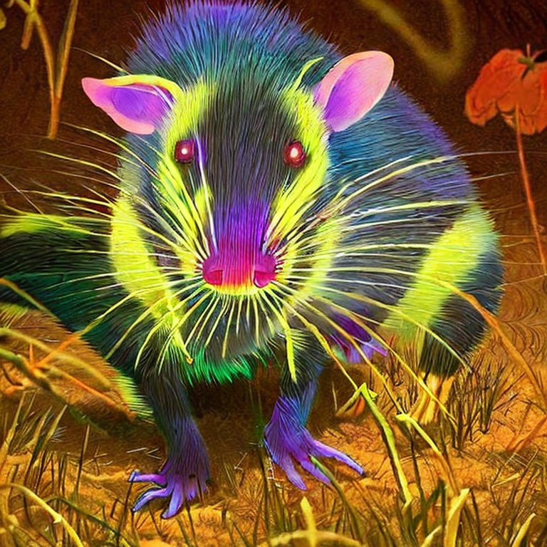
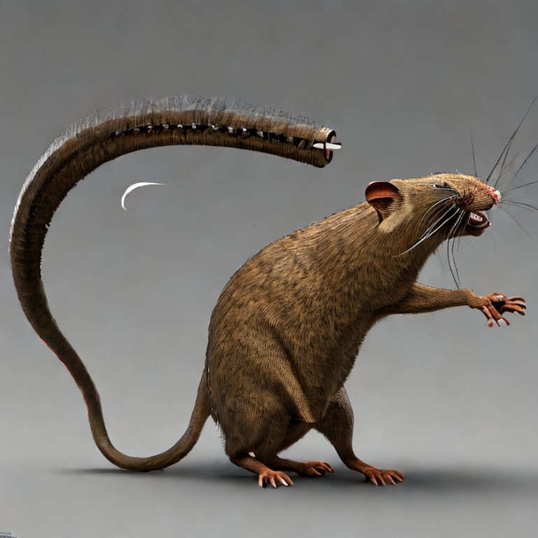
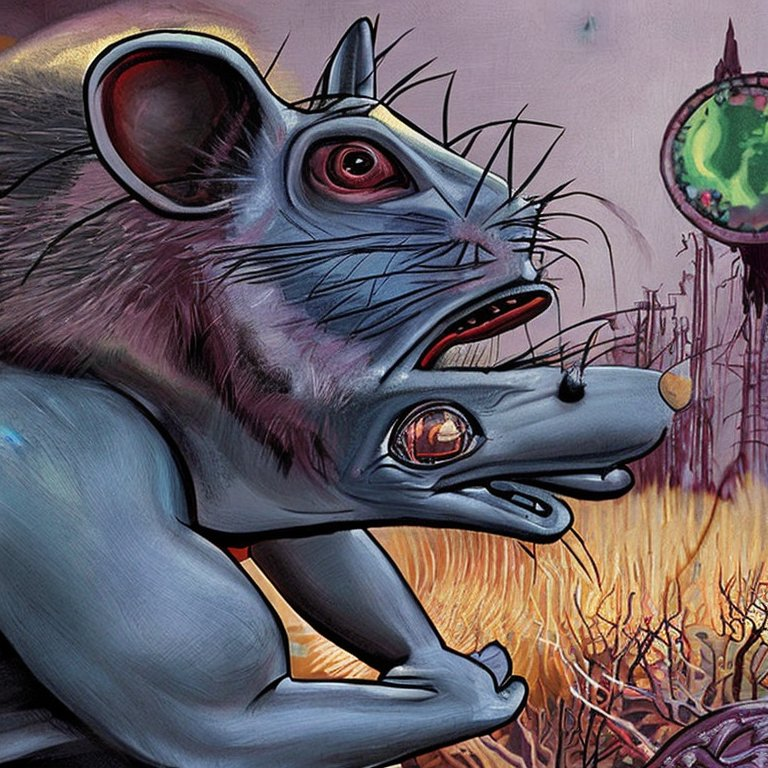
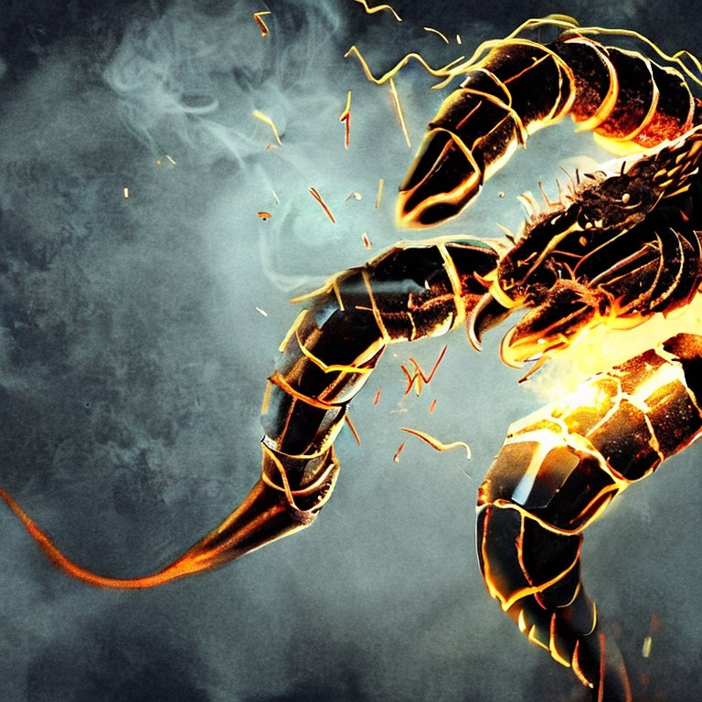
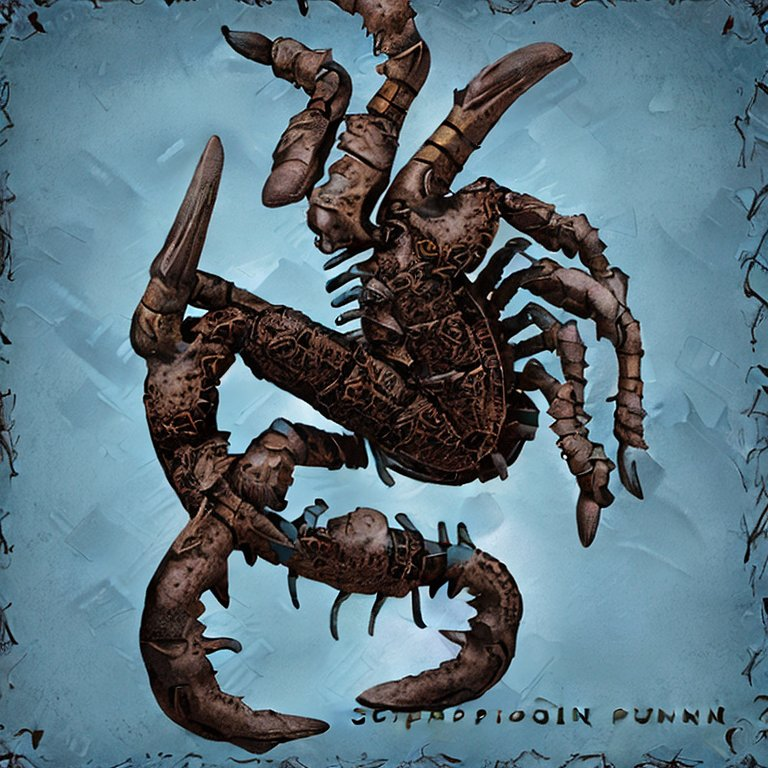

# 🦠🧬: 🏜️💥🔬 Mutant Enemies:

## 1. Irradiated Rodents:
### a) Glow Rat
A small mutant rat with a bioluminescent fur that emits dim light.

| Name           | HP  | AC  | STR | DEX | CON | INT | WIS | CHA | Attack (Primary)                    | Special Ability                                               |
|----------------|-----|-----|-----|-----|-----|-----|-----|-----|-------------------------------------|---------------------------------------------------------------|
| Glow Rat       | 5   | 12  | 4   | 14  | 11  | 2   | 10  | 4   | Bite: +4 to hit, 1d4 piercing dmg   | Emit dim light (10 ft radius)                                 |

### b) Spike-Tail Rat 
A mutant rat with protruding spikes on its tail that can inflict additional damage during attacks.

| Name           | HP  | AC  | STR | DEX | CON | INT | WIS | CHA | Attack (Primary)                    | Special Ability                                               |
|----------------|-----|-----|-----|-----|-----|-----|-----|-----|-------------------------------------|---------------------------------------------------------------|
| Spike-Tail Rat | 7   | 12  | 6   | 14  | 12  | 2   | 10  | 5   | Tail: +4 to hit, 1d4+2 slashing dmg | None                                                          |

### c) Screech Rat 
A mutant rat that emits a high-pitched screech, disrupting focus and concentration of nearby characters.

| Name           | HP  | AC  | STR | DEX | CON | INT | WIS | CHA | Attack (Primary)                    | Special Ability                                               |
|----------------|-----|-----|-----|-----|-----|-----|-----|-----|-------------------------------------|---------------------------------------------------------------|
| Screech Rat    | 5   | 12  | 4   | 15  | 11  | 2   | 12  | 3   | Bite: +4 to hit, 1d4 piercing dmg   | Screech: Disrupt concentration (10 ft radius, DC 10 CON save) |

🦠🧬: 🏜️💥🔬 Stats:

## 2. Nanite-Infected Scorplings:
### a) Electric Scorpling 
A tiny scorpion mutated by nanites that delivers mild electric shocks with its stinger.

| Name                   | HP  | AC  | STR | DEX | CON | INT | WIS | CHA | Attack (Primary)                                       | Special Ability                                           |
|------------------------|-----|-----|-----|-----|-----|-----|-----|-----|--------------------------------------------------------|-----------------------------------------------------------|
| Electric Scorpling     | 5   | 14  | 3   | 15  | 10  | 1   | 8   | 2   | Sting: +4 to hit, 1d4 piercing dmg + 1d4 lightning dmg | None                                                      |

### b) Swarming Scorpling 

A nano-enhanced scorpion capable of releasing a small swarm of tiny, highly poisonous scorplings.

| Name                   | HP  | AC  | STR | DEX | CON | INT | WIS | CHA | Attack (Primary)                                       | Special Ability                                           |
|------------------------|-----|-----|-----|-----|-----|-----|-----|-----|--------------------------------------------------------|-----------------------------------------------------------|
| Swarming Scorpling     | 8   | 14  | 3   | 14  | 12  | 1   | 8   | 2   | Bite: +4 to hit, 1d4 piercing dmg                      | Swarm: Release 3 tiny scorplings (1 HP, +1 to hit, 1 dmg) |

### c) Regenerating Scorpling 
A mutant scorpion that rapidly regenerates itself, requiring precise timing to destroy completely.

| Name                   | HP  | AC  | STR | DEX | CON | INT | WIS | CHA | Attack (Primary)                                       | Special Ability                                           |
|------------------------|-----|-----|-----|-----|-----|-----|-----|-----|--------------------------------------------------------|-----------------------------------------------------------|
| Regenerating Scorpling | 8   | 13  | 5   | 13  | 14  | 1   | 8   | 2   | Bite: +3 to hit, 1d4+1 piercing dmg                    | Regeneration: Heal 2 HP per round                         |

🦠🧬: 🏜️💥🔬 Stats:

## 3. Mutated Insects:
### a) Blight Beetle 
- A mutant beetle with a diseased bite, potentially causing infection.
### b) Acid Ant 
- A large, mutated ant that excretes corrosive acid from its mandibles, capable of damaging armor and weapons.
### c) Quill Fly 
- A mutated fly with razor-sharp spines on its wings, which it can launch at enemies.

🦠🧬: 🏜️💥🔬 Stats:

| Name          | HP  | AC  | STR | DEX | CON | INT | WIS | CHA | Attack (Primary)                                   | Special Ability                                               |
|---------------|-----|-----|-----|-----|-----|-----|-----|-----|----------------------------------------------------|---------------------------------------------------------------|
| Blight Beetle | 6   | 14  | 7   | 12  | 11  | 1   | 7   | 2   | Bite: +4 to hit, 1d4+1 piercing dmg                | Infected Bite (DC 10 CON save, on fail, -1d4 CON for 1d4 hrs) |
| Acid Ant      | 8   | 15  | 7   | 14  | 10  | 1   | 7   | 1   | Bite: +5 to hit, 1d6+1 piercing dmg + 1d4 acid dmg | Acid: Damage armor/weapons (DC 10 DEX save, half dmg)         |
| Quill Fly     | 6   | 13  | 3   | 16  | 8   | 1   | 9   | 1   | Quills: +5 to hit, 1d6+2 piercing dmg              | Launch Quill Volley (20 ft cone, DC 10 DEX save, 1d4 dmg)     |

## 4. Decaying Ghouls:
### a) Fetid Ghoul 
- A rotting, humanoid mutant that exudes a stench nauseating to those nearby.
### b) Fractured Ghoul 
- A ghoul with the ability to break apart into smaller, weaker ghouls as it takes damage.
### c) Grasping Ghoul 
- A ghoul with elongated limbs, allowing it to reach and grab unsuspecting opponents from a distance.

🦠🧬: 🏜️💥🔬 Stats:

| Name            | HP  | AC  | STR | DEX | CON | INT | WIS | CHA | Attack (Primary)                       | Special Ability                                                    |
|-----------------|-----|-----|-----|-----|-----|-----|-----|-----|----------------------------------------|--------------------------------------------------------------------|
| Fetid Ghoul     | 12  | 12  | 15  | 10  | 14  | 6   | 8   | 6   | Slam: +4 to hit, 1d6+2 bludgeoning dmg | Stench (10 ft radius, DC 10 CON save, on fail, poisoned for 1 rnd) |
| Fractured Ghoul | 15  | 12  | 15  | 10  | 14  | 6   | 8   | 6   | Slam: +4 to hit, 1d6+2 bludgeoning dmg | Fracture (splits into two 5 HP weaker ghouls when at 5 HP or less) |
| Grasping Ghoul  | 12  | 11  | 15  | 12  | 14  | 6   | 8   | 6   | Claw: +4 to hit, 1d6+2 slashing dmg    | Grasping Reach (reach increased to 10 ft)                          |

## 5. Post-Apocalyptic Bandits:
### a) Gas Grenadier 
- A bandit equipped with homemade toxic gas grenades, challenging the characters to avoid poisonous clouds.
### b) Rad-Punk Bruiser 
- A melee-focused brawler enhanced with crude mutations for increased strength and endurance.
### c) Scrap Snipe 
- A marksman with a makeshift sniper rifle, using stealth and elevation to snipe opponents from afar.

🦠🧬: 🏜️💥🔬 Stats:

| Name             | HP  | AC  | STR | DEX | CON | INT | WIS | CHA | Attack (Primary)                             | Special Ability                                            |
|------------------|-----|-----|-----|-----|-----|-----|-----|-----|----------------------------------------------|------------------------------------------------------------|
| Gas Grenadier    | 9   | 13  | 10  | 14  | 10  | 9   | 11  | 8   | Dagger: +4 to hit, 1d4+2 piercing dmg        | Gas Grenade (10 ft radius, DC 10 DEX save, 1d4 poison dmg) |
| Rad-Punk Bruiser | 16  | 10  | 17  | 11  | 16  | 8   | 11  | 10  | Club: +5 to hit, 1d6+3 bludgeoning dmg       | Increased STR/CON due to mutations                         |
| Scrap Snipe      | 10  | 14  | 10  | 16  | 12  | 9   | 13  | 9   | Sniper Rifle: +5 to hit, 1d10+2 piercing dmg | Stealth & Elevation tactics                                |

As players grow in levels and experience, you can introduce stronger and more complex mutant variants to challenge their abilities. Remember to make the world engaging and adaptive, basing your encounters on your players' strategies, creativity, and character development. 🌟🤖🧟

Keep in mind, you can adjust the stats and abilities to best fit your group and campaign needs. Understand your players' strengths, weaknesses, and strategies to create engaging, challenging encounters. Happy gaming! 🌟🤖🔮
